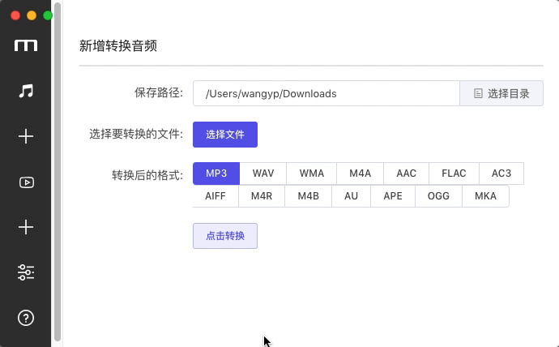

# Electron-learning
Learning demo for electron and nodejs
A cross platform tool. Download youtube videos and convert any audio to mp3 tool

<div align="center">
	<br>
	<div>
		
	</div>
</div>


## INSTALLATION On Mac / 安装环境 Mac 
1. Mac 上安装 youtube-dl , 运行 ```brew install youtube-dl ``` 然后把 youtube-dl 可执行命令 复制到本项目的/resources/mac ``` cp /usr/local/bin/youtube-dl ./resources/mac ```
2. Mac 上安装 ffmpeg 用来转换音频格式, 运行 ```brew install ffmpeg--with-libvpx ```  然后把 ffmpeg 可执行命令 复制到本项目的/resources/mac ``` cp /usr/local/bin/ffmpeg ./resources/mac ```

3. 进入项目目录后, 运行 ```npm install```
4. 然后运行 ```npm install -g @vue/cli```
5. 启动程序, 运行 ```npm run electron:serve```  开启程序.

6. 如果npm i 卡住 可以先 ``` npm install chromedriver --chromedriver_cdnurl=http://cdn.npm.taobao.org/dist/chromedriver ```
7. 把 https://npm.taobao.org/mirrors/electron/4.0.5/chromedriver-v4.0.5-darwin-x64.zip 下载 解压后  替换该项目 electron-learning/node_modules/spectron/node_modules/electron-chromedriver/bin


## INSTALLATION On Windows / 安装环境 windows 

1. 下载 FFmpeg, 通过 https://ffmpeg.zeranoe.com/builds/ 下载对应版本.  然后把 ffmpeg 可执行命令 复制到本项目的/resources/win下
2. 下载 youtube-dl.exe 通过 https://youtube-dl.org/ 下载对应版本. 然后把 youtube-dl.exe 可执行命令 复制到本项目的/resources/win下

3. 其他步骤同Mac环境, 安装node 和 npm等


## How to Build / 打包编译 

1. 运行 ```npm run electron:build```  打包编译, 最后生成在dist_electron 下


## Electron Tutorial / 快速入门 教程

[Electron 快速入门](https://github.com/nodejh/nodejh.github.io/issues/39)


## Resource / 相关资源

[youtube-dl 下载youtube视频工具](https://github.com/rg3/youtube-dl)

[ffmpeg 音频视频转换工具](https://ffmpeg.org/documentation.html)

[ffmpeg 按照脚本 带各种解码器](https://gist.github.com/clayton/6196167)

[electron taobao的镜像 chromedriver-v4.0.5-darwin-x64.zip](https://npm.taobao.org/mirrors/electron/4.0.5/)


## File structure / 文件结构

1. Entry file 入口文件为 src/background.js, 此为electron 主进程文件. 在package.json可以修改该入口文件.
2. src/background.js 运行后启动 public/index.html,  进入页面后启动 src/main.js  即Vue的第一个js文件.
3. src/main.js 调用IndexApp.vue组件 运行Vue的第一个组件.
